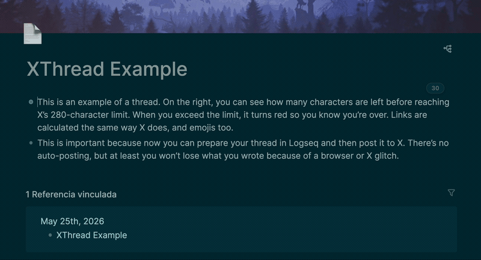

# XThread — Logseq plugin

Write X (Twitter) threads inside Logseq.

- **1 block = 1 tweet** of the thread.
- **Floating counter** showing remaining characters in the top-right corner of the focused block. Orange under 20 left / **red when negative** if you go over.
- **Visual overflow highlight**: characters beyond 280 are painted with a translucent red background. Nothing is deleted or truncated.
- **Faithful X rule**: URLs count as 23, CJK and emoji count as 2, `\n` (Shift+Enter) counts as 1.
- **Persistence**: Logseq saves every change to the page's `.md`, no extra work needed.

## Install

1. Download `xthread.zip` and unzip it into a folder of your choice.
2. Logseq → ··· → **Settings** → **Advanced** → **Developer mode** → ON
3. Logseq → ··· → **Plugins** → **Load unpacked plugin**
4. Select the folder where you unzipped `xthread`.
5. Enable the plugin.

> **Needs internet on first load**: the plugin pulls `@logseq/libs` from unpkg (CDN). If you start Logseq offline, it won't hook into the editor.

## Usage

Create a new page: each thread is a page, each block (line) is a tweet of the thread.

- Focusing a block shows the counter with the remaining characters.
- The number turns orange under 20 left and red when negative if you go over.
- Characters beyond 280 stay in the block but are painted with a red background, so you see exactly what's over the limit.
- For the next tweet in the thread, hit Enter and write in the next block.

## How it counts

Replicates the `twitter-text` v3 algorithm:

- Characters in U+0000–U+10FF and some general-punctuation ranges = 1 each
- Everything else (CJK, emoji…) = 2 each
- URLs (`http(s)://…` or `www.…`) = 23 regardless of actual length

## Roadmap

- [ ] More faithful URL detection (TLDs without protocol, `t.co`)
- [ ] X-style circular indicator instead of a plain number
- [ ] Slash command to export the numbered thread to the clipboard
- [ ] Handle IME composition (Chinese/Japanese) without trimming mid-composition

---

# XThread — plugin de Logseq

Escribe hilos de X (Twitter) dentro de Logseq.

- **1 bloque = 1 tweet** del hilo.
- **Contador flotante** con caracteres restantes en la esquina superior derecha del bloque enfocado. Verde / naranja a partir de 20 restantes / **rojo en negativo** si te pasas.
- **Marcado visual del exceso**: los caracteres que se quedan fuera de los 280 se pintan con fondo rojo translúcido. Nada se borra ni se trunca.
- **Regla real de X**: URLs cuentan 23, CJK y emojis cuentan 2, `\n` (Shift+Enter) cuenta 1.
- **Persistencia**: Logseq guarda cada cambio en el `.md` de la página, sin trabajo extra.

## Instalar

1. Descomprime `xthread.zip` en una carpeta de tu elección.
2. Logseq → ··· → **Settings** → **Advanced** → **Developer mode** → ON
3. Logseq → ··· → **Plugins** → **Load unpacked plugin**
4. Selecciona la carpeta donde descomprimiste `xthread`.
5. Activa el plugin.

> **Necesita internet la primera vez**: el plugin carga `@logseq/libs` desde unpkg (CDN). Si arrancas Logseq sin conexión, el plugin no engancha al editor.

## Uso

Crea una página nueva: cada hilo es una página. Cada bloque (línea) es un tweet del hilo.

- Al enfocar un bloque aparece el contador con los caracteres restantes.
- El número se pone naranja a partir de 20 restantes y rojo en negativo si te pasas.
- Los caracteres por encima de 280 se quedan en el bloque pero pintados con fondo rojo, para que veas exactamente lo que sobra.
- Para el siguiente tweet del hilo, Enter y a escribir en el siguiente bloque.

## Cómo cuenta

Replica el algoritmo de `twitter-text` v3:

- Caracteres en U+0000–U+10FF y algunos rangos de puntuación general = 1 cada uno
- Resto (CJK, emojis…) = 2 cada uno
- URLs (`http(s)://…` o `www.…`) = 23 sin importar la longitud real

## Pendiente

- [ ] Detección de URLs más fiel (TLDs sin protocolo, `t.co`)
- [ ] Indicador circular tipo X en lugar de número
- [ ] Slash command para exportar el hilo numerado al portapapeles
- [ ] Manejar IME composition (chino/japonés) sin trimear a mitad de composición
